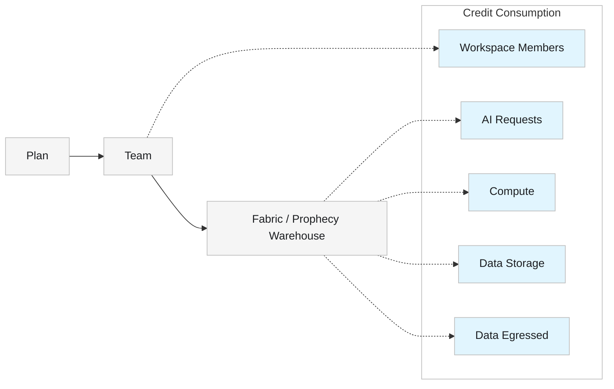

<Callout icon="/images/icon.png" color="#FFC107">  Credits apply to the [Free and Professional Editions](/administration/platform/editions) only. </Callout>

In Prophecy, **credits** are a single, shared unit of usage across the platform. Instead of paying separately for compute, storage, data movement, seats, and AI features, your team draws all of it from one credit balance.

A credit is a fixed amount of value that gets consumed at different rates. Adding a teammate draws down your balance differently than running a pipeline or making an AI request does. Two teams with the same credit balance can burn through credits at different speeds, depending on how they use the platform.

The table in [How credits are charged](#how-credits-are-charged) shows exactly how each type of usage draws from your balance.

Plans, teams, and fabrics define how billing and credit consumption are organized:

- A **plan** is the top-level billing unit. Each plan includes exactly one team.
- A **team** represents a group of users who share access to resources through one fabric.
- A **fabric** points to a dedicated warehouse and compute resource.

<Info>  To view your remaining credits, monitor usage trends, or purchase additional credits, open [Usage and billing](/administration/management/usage-billing/usage-billing) in Prophecy. </Info>

## Plans and credit allocation

| Plan                                                  | Price           | Credits              | Reset                             |
| ----------------------------------------------------- | --------------- | -------------------- | --------------------------------- |
| **Free trial**                                        | Free            | 50 credits, one-time | Valid for 14 days; does not reset |
| **Starter** (Professional Edition)                    | Free            | 5 credits/month      | Monthly                           |
| **Pro** (Professional Edition and Structured Finance) | $150 / user / month | 50 credits/month     | Monthly                           |

<Note>  Structured Finance runs on Professional Edition. The Pro plan terms above apply to Structured Finance as well. </Note>

There is currently no limit on the number of users per team on the Pro plan.

## How credits are charged

The following actions consume the corresponding number of credits.

Compute charges depend on how long your workload runs. Larger datasets, more complex transformations, and longer-running pipelines consume more compute credits than smaller or shorter jobs.

| Action            | Description                                              | Unit price in credits                                        |
| ----------------- | -------------------------------------------------------- | ------------------------------------------------------------ |
| **AI Requests**   | Each time you click on Copilot or interact with an Agent | 0.04 / request |
| **Compute**       | Processing required when running a gem or pipeline       | 0.12 credits/hour |
| **Data Egressed** | Data sent outside the Prophecy warehouse                 | 0.045 / GB                                                   |
| **Data Storage**  | Data stored in a warehouse                   | 0.02 / GiB / month                                           |
| **Workspace members**  | Number of users allowed on your plan                     | 75 / user / month |

## Relationship diagram

The following diagram shows how credit consumption actions relate to plans, teams, and fabrics.

## Examples of credit use

| Action                             | Credit impact               |
| ---------------------------------- | --------------------------- |
| Ask Copilot a question             | AI request                  |
| Run a small pipeline               | Compute                     |
| Publish an analysis                | No additional credit charge |
| Store 10 GiB of data for one month | Storage                     |

## What happens when you run out of credits?

When you run out of credits, the following features will be disabled:

- Prophecy Agent
- Interactive pipeline runs
- Scheduled pipeline runs
- Project publication (deployment)

After credits are added to your account, disabled features become available again. You can purchase additional credits from the Usage and Billing page.
