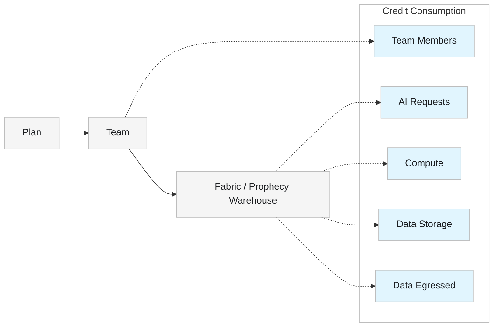

<Callout icon="/images/icon.png" color="#FFC107">  Credits apply to the [Free and Professional Editions](/administration/platform/editions) only. </Callout>

In Prophecy, **credits** are a single, shared unit of usage across the platform. Instead of paying separately for compute, storage, data movement, seats, and AI features, your team draws all of it from one credit balance.

A credit is a fixed amount of value that gets consumed at different rates depending on what's using it. Adding a teammate draws down your balance very differently than running a pipeline or making an AI request does. Two teams with the same credit balance can burn through credits at different speeds, depending on how they use the platform.

The table in [How credits are charged](#how-credits-are-charged) shows exactly how each type of usage draws from your balance.

Plans, teams, and fabrics define how billing and credit consumption are organized:

- A **plan** is the top-level billing unit. Each plan includes exactly one team.
- A **team** represents a group of users who share access to resources through one fabric.
- A **fabric** points to a dedicated Prophecy warehouse database and compute resources.

<Info>  To learn about monitoring credit usage and buying additional credits, see [Usage and billing](/administration/management/usage-billing/usage-billing). </Info>

## Plans and credit allocation

| Plan                                                  | Price           | Credits              | Reset                             |
| ----------------------------------------------------- | --------------- | -------------------- | --------------------------------- |
| **Free trial**                                        | Free            | 50 credits, one-time | Valid for 14 days; does not reset |
| **Starter** (Professional Edition)                    | Free            | 5 credits/month      | Monthly                           |
| **Pro** (Professional Edition and Structured Finance) | $150/user/month | 50 credits/month     | Monthly                           |

<Note>  Structured Finance runs on Professional Edition — it isn't a separate edition or pricing tier. The Pro plan terms above apply to both. </Note>

There is currently no limit on the number of users per team on the Pro plan.

## How credits are charged

The following actions consume the corresponding number of credits.

| Action            | Description                                              | Credits Consumed                                             |
| ----------------- | -------------------------------------------------------- | ------------------------------------------------------------ |
| **Team Members**  | Number of users allowed on your plan                     | 20 / user / month                                            |
| **AI Requests**   | Each time you click on Copilot or interact with an Agent | 0.04 / request |
| **Compute**       | Processing required when running a gem or pipeline       | 0.12 credits/hour |
| **Data Egressed** | Data sent outside the Prophecy warehouse                 | 0.045 / GB                                                   |
| **Data Storage**  | Data stored in the Prophecy warehouse                    | 0.02 / GiB / month                                           |

<Note>  The Prophecy warehouse is powered by DuckDB. Advanced users can update the DuckDB SQL queries in the **Code** view of their project to optimize computation and reduce credit consumption. </Note>

<Callout icon="/images/icon.png" color="#FFC107">  `TBD — Compute billing for external warehouses (Databricks, BigQuery).` When a fabric points to an external warehouse instead of Prophecy's own, most transformation processing happens on that external warehouse rather than in the Prophecy sandbox. Final billing treatment for this scenario (egress-only vs. egress + sandbox compute) is pending confirmation — this section will be updated once finalized for this release. </Callout>

## Relationship diagram

The following diagram shows how credit consumption actions relate to plans, teams, and fabrics.



## What happens when you run out of credits?

When you run out of credits, the following features will be disabled:

- Prophecy Agent
- Interactive pipeline runs
- Scheduled pipeline runs
- Project publication (deployment)

```
TBD — internal planning references a soft alert threshold and a hard limit threshold before this point (e.g. spending guardrails at set dollar amounts). If these ship in this release, add a short "Alerts" section here describing what a user sees and when, before the hard cutoff above. Do not publish specific dollar thresholds until confirmed as final and customer-facing.
```
