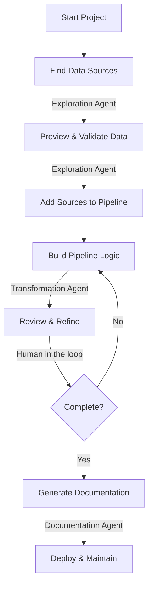

The Prophecy Agent uses natural language to build, modify, and interpret pipelines, analyses, documentation, and related project artifacts.

When you describe your intent, the Agent inspects your active project, searches metadata, retrieves sample data where permitted, and generates or updates transformations directly within the project.

<Tip>
Importing from Alteryx or other platforms? You can start by [importing these intro Prophecy](https://docs.prophecy.ai/import-tool). Then use the Agent to modify and extend these workflows.
</Tip>

## Why use the Agent?

The Agent accelerates pipeline development by reducing the manual steps required to build and modify data workflows.

Instead of navigating multiple interfaces, you describe intent. The Agent translates that intent into concrete, inspectable project changes within your active environment.

The Agent assists development; it does not autonomously deploy or promote changes.

## Scope and control

The Agent operates within the currently active project and under the permissions of the user who invoked it.

- All SQL execution and pipeline runs occur under your existing credentials.
- All changes remain visible, versioned, and editable within Prophecy.

Prophecy includes specialized agents for transformation, harmonization, and documentation workflows. The Transform Agent runs separately from the Documentation and Harmonization Agents. To use the Harmonization Agent or Documentation Agent, you must disable the Transform Agent. (Harmonization and Documentation can be used without disabling one another.)

- [Transform Agent](/data-analysis/ai/agent/transform) (default) — Builds and modifies pipelines, analyses, and documentation using natural language.
- [Harmonization Agent](/data-analysis/ai/agent/harmonization/overview) — Automates mapping source data to a defined Common Data Model (CDM).
- [Documentation Agent](/data-analysis/ai/agent/documentation/documentation) — Generates complete project and pipeline documentation.

## Workflow

Agent workflows vary depending on the active agent.

### Transform Agent workflow (default)

The Transform Agent focuses on building and modifying [pipelines](/data-analysis/), [analyses](/data-analysis/ai/agent/analyses), and related project artifacts within the active project.

When you submit a request, the Agent:

- Interprets your intent.
- Inspects the current project graph and schema metadata.
- Generates or modifies pipeline logic.
- Validates transformations and project structure.
- Surfaces changes for review.

The Transform Agent supports two primary intents throughout the pipeline development lifecycle:

- [Exploration](/data-analysis/ai/agent/explore) for discovering and understanding data sources.
- [Transformation](/data-analysis/ai/agent/transform) for building and modifying pipeline logic.

Use the Agent to search your data warehouse, preview datasets, and validate data quality before building transformations. During transformation, describe data operations in natural language to generate gems and modify pipeline logic.

### Harmonization workflow

The [Harmonization Agent](/data-analysis/ai/agent/harmonization/overview) focuses on mapping source schemas to a defined Common Data Model (CDM).

The workflow typically includes:

- Defining or selecting a CDM.
- Generating source-to-target mappings.
- Reviewing confidence indicators and data quality tests.

## Agent architecture

The Prophecy Agent operates within Prophecy’s structured execution environment and is equipped with tools to query warehouses, compile code, run pipelines, and modify project artifacts directly.

Rather than generating text alone, the Agent uses controlled internal tools to inspect, modify, and validate project assets directly within the active project.

This enables the Agent to reason over:

- Your project's structure (pipelines, analyses, datasets, documentation).
- Schema metadata and dataset relationships.
- Version-controlled project artifacts.

### Tool-based execution

The Agent uses a set of internal tools to take concrete actions inside your project, including:

- Querying your connected warehouse.
- Retrieving metadata and sample data.
- Compiling and validating code.
- Running pipelines.
- Creating and editing project artifacts.

When the Agent executes SQL or runs a pipeline, it does so under the permissions of the user who invoked it. All warehouse interactions respect existing access controls and governance policies.

Before applying changes, the Agent compiles and validates generated logic against your project structure to detect syntax errors, broken references, or incompatible transformations.

### Schema and lineage awareness

The Agent understands your project’s schema metadata and dataset relationships. When generating or modifying transformations, it:

- Inspects upstream schema definitions.
- Validates generated changes against your project structure before applying them.
- Surfaces potential conflicts or mismatches when detected.

The Agent assists with structural consistency but does not override warehouse-level schema constraints.

### Project boundary

All Agent activity is strictly contained within the active project and cannot affect external projects or platform-level configuration.

It can:

- Create and refactor pipelines.
- Generate and update analyses.
- Modify documentation.
- Edit datasets and other project artifacts.

### Single-agent editing

Only one Agent session can edit a project at a time. Collaborative agent editing across multiple users is not supported.

### Human in the loop

The Agent generates and can apply changes inside your project, but you remain in control. All modifications are visible in the editor and can be inspected, edited, or reverted. You can:

- Inspect every transformation.
- Validate data samples.
- Modify generated logic.
- Re-run pipelines as needed.

The Agent does not replace review. Users remain responsible for validating logic, data correctness, and production readiness.

## Available features

<AccordionGroup>

<Accordion title="Search through your data environment">
  Use table metadata—table names, schemas, owners, and tags—to locate datasets from your fabric.
  When you don't know the exact table name or work with many tables, searching through metadata
  eliminates guesswork and reduces time spent browsing schema lists. You can find data from your
  connected data warehouse, cloud storage, reporting platforms, and other sources.
</Accordion>

<Accordion title="Retrieve and visualize sample data from your data environment">
  Preview data samples and visualizations before selecting datasets for your pipeline. Understanding
  column structures, data patterns, and potential quality issues helps you make informed decisions
  about which tables to use.
</Accordion>

<Accordion title="Build pipelines step-by-step or all in one prompt">
  Generate complete pipelines from a single description when requirements are clear, or build
  incrementally gem by gem, adding one transformation at a time in a linear sequence. Instead of
  manually dragging gems onto the canvas and configuring each step, describe your goal and let the
  Agent handle the setup.
</Accordion>

<Accordion title="Transform data automatically to match a defined schema">
  The Harmonization Agent lets you define a Common Data Model (CDM) and generate mappings that conform input data to the CDM. Learn more in the [Harmonization](/data-analysis/ai/agent/harmonization/overview) documentation.
</Accordion>

<Accordion title="Remove redundant steps and improve readability">
  Clean up existing pipelines by removing unnecessary transformations and consolidating logic.
  Easier-to-maintain pipelines execute faster, and clearer logic helps teammates understand your
  work without deciphering complex transformation chains.
</Accordion>

<Accordion title="Summarize pipeline logic and datasets">
  Get a high-level explanation of what a pipeline does and which datasets it uses without reading
  through every transformation. Understanding existing pipelines quickly helps with onboarding,
  while documenting your own work makes it easier for others to use and modify later.
</Accordion>

</AccordionGroup>

## Features in progress

Features in progress are subject to the same project-scope and permission constraints as existing capabilities.

<AccordionGroup>

<Accordion title="Find tables based on similar datasets">
  Provide sample data to the Agent and retrieve similar datasets from your fabric.
</Accordion>

<Accordion title="Make targeted updates to an existing pipeline">
  Iterate on granular aspects of the pipeline while ensuring previous work remains intact.
</Accordion>

<Accordion title="Find pipeline optimizations and simplifications">
  Identify opportunities to improve pipeline performance using methods such as query optimizations,
  caching, or simplified joins.
</Accordion>

<Accordion title="Prompt a reindex of the knowledge graph">
  Ask the Agent to start crawling sources to ensure the most up-to-date metadata in the knowledge
  graph.
</Accordion>

<Accordion title="Build and run data tests and unit tests">
  Generate tests to validate data quality and catch errors before pipelines run in production.
</Accordion>

<Accordion title="Recommend packages for your project">
  Find relevant packages that help build out your pipeline for your specific use case.
</Accordion>

<Accordion title="Schedule and deploy projects">
  Automate moving pipelines from development to production.
</Accordion>

<Accordion title="Perform version control actions">
  Track changes, create branches, and manage pipeline versions through the Agent interface.
</Accordion>

</AccordionGroup>
