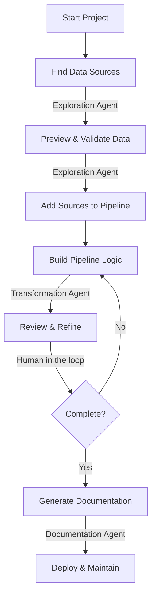

## What does the Agent do?

The Prophecy Agent uses natural language to interact with your data warehouse and build pipelines. Describe what you need, and the Agent searches metadata, retrieves sample data, generates transformations, and optimizes existing pipelines. Use it to build pipelines incrementally or generate complete pipelines from a single prompt.

## Why use the Agent?

The Agent accelerates pipeline development by eliminating manual steps in the development workflow. Instead of browsing schema lists, manually configuring gems, or writing documentation from scratch, you describe your intent and the Agent handles the implementation. This reduces switching between tools, decreases the time spent on repetitive configuration tasks, and allows you to focus on the business logic.

## Workflow

The Agent handles three primary intents throughout the pipeline development lifecycle:

- [Exploration](/data-analysis/ai/agent/explore) for discovering and understanding data sources.
- [Transformation](/data-analysis/ai/agent/transform) for building and modifying pipeline logic.
- [Documentation](/data-analysis/ai/agent/documentation/documentation) for generating complete project and pipeline documentation.

Use the Agent to search your data warehouse, preview datasets, and validate data quality before building transformations. During transformation, describe data operations in natural language to generate gems and modify pipeline logic. After completing your pipeline, automatically generate documentation in Markdown that describe your project structure and pipeline logic.

## Available features

<AccordionGroup>

<Accordion title="Search through your data environment">
  Use table metadata—table names, schemas, owners, and tags—to locate datasets from your fabric.
  When you don't know the exact table name or work with many tables, searching through metadata
  eliminates guesswork and reduces time spent browsing schema lists. You can find data from your
  connected data warehouse, cloud storage, reporting platforms, and other sources.
</Accordion>

<Accordion title="Retrieve and visualize sample data from your data environment">
  Preview data samples and visualizations before selecting datasets for your pipeline. Understanding
  column structures, data patterns, and potential quality issues helps you make informed decisions
  about which tables to use.
</Accordion>

<Accordion title="Build pipelines step-by-step or all in one prompt">
  Generate complete pipelines from a single description when requirements are clear, or build
  incrementally gem by gem, adding one transformation at a time in a linear sequence. Instead of
  manually dragging gems onto the canvas and configuring each step, describe your goal and let the
  Agent handle the setup.
</Accordion>

<Accordion title="Remove redundant steps and improve readability">
  Clean up existing pipelines by removing unnecessary transformations and consolidating logic.
  Easier-to-maintain pipelines execute faster, and clearer logic helps teammates understand your
  work without deciphering complex transformation chains.
</Accordion>

<Accordion title="Summarize pipeline logic and datasets">
  Get a high-level explanation of what a pipeline does and which datasets it uses without reading
  through every transformation. Understanding existing pipelines quickly helps with onboarding,
  while documenting your own work makes it easier for others to use and modify later.
</Accordion>

</AccordionGroup>

## Features in progress

<AccordionGroup>

<Accordion title="Find tables based on similar datasets">
  Provide sample data to the Agent and retrieve similar datasets from your fabric.
</Accordion>

<Accordion title="Make targeted updates to an existing pipeline">
  Iterate on granular aspects of the pipeline while ensuring previous work remains intact.
</Accordion>

<Accordion title="Find pipeline optimizations and simplifications">
  Identify opportunities to improve pipeline performance using methods such as query optimizations,
  caching, or simplified joins.
</Accordion>

<Accordion title="Prompt a reindex of the knowledge graph">
  Ask the Agent to start crawling sources to ensure the most up-to-date metadata in the knowledge
  graph.
</Accordion>

<Accordion title="Build and run data tests and unit tests">
  Generate tests to validate data quality and catch errors before pipelines run in production.
</Accordion>

<Accordion title="Recommend packages for your project">
  Find relevant packages that help build out your pipeline for your specific use case.
</Accordion>

<Accordion title="Schedule and deploy projects">
  Automate moving pipelines from development to production.
</Accordion>

<Accordion title="Perform version control actions">
  Track changes, create branches, and manage pipeline versions through the Agent interface.
</Accordion>

</AccordionGroup>
