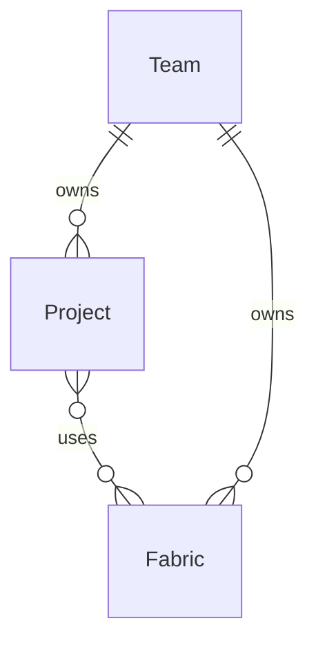

Prophecy lets you work with various data providers when building your pipelines. To read and write data from external sources, create **connections** inside a [Prophecy fabric](/data-analysis/environment/fabrics/prophecy-fabrics).

When you attach to a fabric with connections, you can:

- Reuse credentials that are established in the connection.
- Browse data from the data provider in the [Environment browser](/data-analysis/development/studio/studio#sidebar) of your Prophecy project.

<Info>
  Most connections are only used to read from and write to data sources. The SQL Warehouse
  connection is an exception: it also provides the compute environment for pipeline execution.
</Info>

## Connections access

Prophecy controls access to connections through fabric-level permissions. To access a connection, you must have access to the fabric that contains the connection. You can only access fabrics that are assigned to one of your teams.

<Frame>

</Frame>

In this diagram, the lines show relationships between entities. `||--||` indicates a one-to-one relationship, `||--o{` indicates a one-to-many relationship (one entity on the left can relate to many entities on the right), and `}o--o{` indicates a many-to-many relationship.

## Add a new connection

To configure a new connection in a Prophecy fabric:

1. Open the **Metadata** page from the left sidebar in Prophecy.
1. Navigate to the **Fabric** tab.
1. Open the fabric where you want to add the connection.
1. Navigate to the **Connections** tab.
1. Click **+ Add Connection**. This opens the **Create Connection** dialog.
1. Select a data provider from the list of connection types.
1. Click **Next** to open the connection details.
1. Configure the connection and save your changes.

Learn about individual connection parameters in the connection's respective reference page.

To make connections configurable across projects or pipelines, use [connection parameters](/data-analysis/development/parameters/parameters).

## View connection status

Connection status indicates whether Prophecy can reach your data sources through network connectivity tests. Status appears in the **Connections** tab of your fabric.

Each connection displays one of four statuses:

- **Connected**: Network connectivity test passed. You can use the connection.
- **Disconnected**: Network connectivity test failed. Common causes include a firewall blocking the connection or expired credentials.
- **Inactive**: The connection hasn't been used within the past week. Prophecy suspends network connectivity testing for inactive connections to reduce overhead. Testing resumes automatically when you use the connection again.
- **Not tested**: This indicates that Prophecy does not support network connectivity testing for this connection type.

## What's next

Visit the following pages for details about individual connections.
