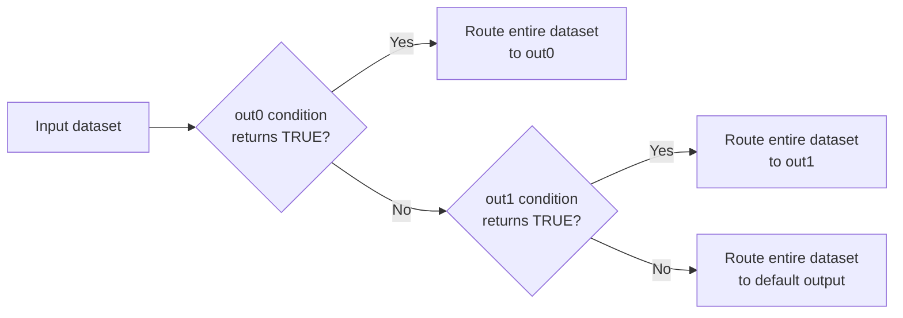

The Condition gem evaluates a series of conditions and routes the entire input dataset to the first output whose condition evaluates to `true`. This makes it useful for pipeline control flow, data quality checks, and conditional execution.

## How it works

Each output port contains a condition that must evaluate to a single boolean value (`true` or `false`).

The Condition gem evaluates output ports from top to bottom:

1. Evaluate the first output condition.
2. If the condition evaluates to `true`, route the entire input dataset to that output.
3. Otherwise, evaluate the next output.
4. Continue until a condition evaluates to `true`.
5. If no conditions evaluate to `true`, route the dataset to the final (default) output.

<Note>
Only one output receives the input dataset. The Condition gem chooses a single route for the entire dataset; it does not split rows across multiple outputs.
</Note>

After a condition evaluates to `true`, later conditions are not evaluated.

## Condition requirements

Each condition must return exactly one row containing a boolean value.

Conditions that return multiple rows are invalid and cause the pipeline to fail with a scalar subquery error.

For example:

| Condition | Result | Valid |
|-----------|--------|-------|
| `count > 1000` | One boolean value | ✓ |
| `sum(amount) > threshold` | One boolean value | ✓ |
| `A = 1` | One result per input row | ✗ |

Conditions typically use aggregate functions or expressions that evaluate the input dataset as a whole.

## Use the Condition gem

1. Add a **Condition** gem to your pipeline from the **Custom** category.
2. Connect an input to the gem.
3. Define a condition for each output.
4. Click **Add Routing Rule** or **+** to add additional outputs.
5. Arrange outputs in the order you want them evaluated.
6. Connect downstream gems to each output.

The gem starts with two output ports by default.

## Output behavior

Only one output receives the input dataset.

All downstream branches still execute, even when they receive zero rows. Outputs that are not selected receive empty dataframes.



For example, if `out0` evaluates to `true`, the pipeline behaves like this:

| Output | Rows |
|--------|------|
| out0 | All input rows |
| out1 | 0 |
| out2 | 0 |

Downstream transformations should therefore handle empty dataframes.

Some operations, such as aggregations, may still produce output when their input dataframe is empty. For example, a count aggregation can return a single row.


## Example: Route based on row count

Assume your pipeline receives 25 rows.

Configure the Condition gem as follows:

- `out0`: `count < 10`
- `out1`: `count < 100`
- `out2`: default

The Condition gem evaluates the outputs in order.

- `count < 10` evaluates to `false`.
- `count < 100` evaluates to `true`.

The entire dataset is routed to `out1`.

`out0` and `out2` still execute but receive empty dataframes.

## Example: Invalid condition

Assume the input contains:

| A |
|---|
| 1 |
| 2 |

The following condition is invalid:

```
A = 1
```

The expression produces two results:

| Result |
|--------|
| true |
| false |

Because the condition returns multiple rows instead of a single boolean value, the Condition gem fails with a scalar subquery error.

To use the Condition gem successfully, each condition must evaluate to exactly one boolean value.

## Example use cases

Use the Condition gem when you need to:

- Route a pipeline based on dataset size.
- Apply data quality guardrails.
- Trigger different processing paths based on aggregate metrics.
- Implement pipeline control flow.

## Limitations

- Conditions are evaluated from top to bottom.
- The first condition that evaluates to `true` determines the output.
- Only one output receives the input dataset.
- Each condition must evaluate to exactly one boolean value.
- Conditions that return multiple rows cause the pipeline to fail.
- Downstream logic must handle empty dataframes.

## Filter vs Condition gem

Use the [Filter gem](/data-analysis/gems/prepare/filter) when you want to keep or remove rows.

Use the Condition gem when you want to choose between multiple execution paths.

| Filter gem | Condition gem |
|------------|---------------|
| Filters rows | Chooses one pipeline branch |
| Output contains matching rows | Output contains the entire input dataset |
| Evaluates each row | Evaluates one boolean condition |
| Can reduce a dataset | Selects one output path |


