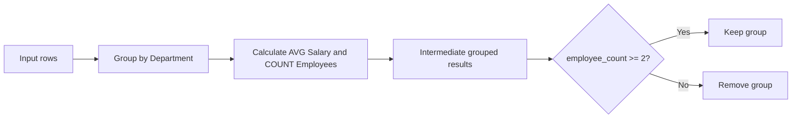

import Execution from '/snippets/gem-execution-engine.mdx';
import GemExample from '/snippets/interactive-gem.mdx';

<Execution execution_engine="the SQL warehouse" />

## Overview

By default, the Aggregate gem provides a guided interface for defining grouping columns, aggregation functions, and aggregate filters. If you need more complex expressions, you can switch to Advanced mode to edit the underlying SQL configuration directly.

The Aggregate gem transforms many input rows into fewer output rows. It groups records that share the same values and calculates summary statistics for each group.

Common use cases include:

- Counting orders per customer.
- Calculating total sales by region.
- Finding average transaction values.
- Summarizing records by category or date.
- Creating grouped metrics for dashboards and downstream analysis.

The Aggregate gem works similarly to a SQL `GROUP BY` statement.

<GemExample gemName="Aggregate" />

## Modes

The Aggregate gem supports two editing modes:

| Mode                      | Description                                                                                                       |
| ------------------------- | ----------------------------------------------------------------------------------------------------------------- |
| **Simple mode** (default) | Build aggregations using guided controls for grouping, aggregation functions, and aggregate filters.              |
| **Advanced mode**         | Edit the full Aggregate configuration directly for complex expressions that cannot be represented in Simple mode. |

## Simple mode

Simple mode organizes the Aggregate gem into three collapsible sections.

| Section               | Description                                                                                               |
| --------------------- | --------------------------------------------------------------------------------------------------------- |
| **Grouping**          | Choose one or more columns to group by. Optionally rename the output column for each grouping expression. |
| **Aggregations**      | Select an aggregation function, choose the input column, and provide an output column name.               |
| **Aggregate Filters** | Filter grouped results after aggregation using a HAVING expression.                                       |

## Supported aggregation functions

| Function       | Description                                |
| -------------- | ------------------------------------------ |
| count          | Counts rows.                               |
| count distinct | Counts distinct values.                    |
| sum            | Returns the total.                         |
| avg            | Returns the average.                       |
| min            | Returns the minimum value.                 |
| max            | Returns the maximum value.                 |
| any_value      | Returns an arbitrary value from the group. Use `ANY_VALUE` when every row in a group has the same value, or when any representative value is acceptable. |
| stddev         | Returns the standard deviation.            |
| variance       | Returns the variance.                      |
| collect_list   | Returns an array containing all values.    |
| collect_set    | Returns an array containing unique values. |

## Complex expressions

Simple mode supports standard grouping columns and aggregation expressions such as `sum(order_amount)` or `avg(age)`.

If an existing Aggregate gem contains more advanced expressions, Simple mode displays a message indicating that the configuration is too complex to edit.

For example, Simple mode does note support calculated grouping expressions such as `sum(a) + sum(b)`.

In these cases, you have two options:

- **Switch to Advanced Mode** lets you edit the existing configuration in Advanced Mode.
- **Reset and use Default Mode** clears the grouping and aggregation configurations so that you can start over.

<Warning>

**Reset and use Default Mode** permanently removes the existing grouping and aggregation configuration. Aggregate Filters (HAVING conditions) are preserved.

</Warning>

## How Aggregate works

The Aggregate gem processes data in three main steps:

1. Group rows based on the selected **Group By** columns.
2. Calculate aggregation expressions for each group.
3. Optionally filter grouped results using **Having Conditions**.

### Example grouping

| Department | Average salary | Employee count |
| ---------- | -------------: | -------------: |
| HR         |             75 |              2 |
| IT         |           92.5 |              2 |
| Sales      |             60 |              1 |

After applying `employee_count >= 2`, `Sales` is removed.

Unlike a Filter gem, the **Having Conditions** are evaluated after aggregation is complete.

For example:

- A Filter gem can remove individual rows before grouping.
- A Having condition can remove grouped results after calculations are complete.

## Common use cases

| Goal | Group By | Expression |
| --- | --- | --- |
| Count orders per customer | `customer_id` | `count(order_id)` |
| Calculate total revenue by region | `region` | `sum(order_amount)` |
| Find average order value by sales rep | `sales_rep` | `avg(order_amount)` |
| Get the latest transaction date per account | `account_id` | `max(transaction_date)` |
| Count distinct products sold by store | `store_id` | `count_distinct(product_id)` |

## Example

Suppose you have a dataset of orders that includes heathcare users with the following columns.

| Column name               | Description                                                                |
| ------------------------- | -------------------------------------------------------------------------- |
| `persona`                 | Customer or employee segment used for demographic and behavioral analysis. |
| `age`                     | Employee age in years.                                                     |
| `annual_household_income` | Total annual household income.                                             |
| `dependents_on_plan`      | Number of dependents enrolled in the employee's healthcare plan.           |

You can use the Aggregate gem to summarize users by `persona` and calculate average demographic metrics for each segment.

### Example configuration

| Grouping  | Aggregation                    | Output column                   |
| --------- | ------------------------------ | ------------------------------- |
| `persona` | `avg(annual_household_income)` | `average_household_income`      |
|           | `avg(age)`                     | `average_age`                   |
|           | `avg(dependents_on_plan)`      | `avg_number_dependents_on_plan` |
|           | `any_value(persona)`           | `persona`                       |

### Result

This configuration:

- Groups all rows by `persona`.
- Calculates the average household income, age, and number of dependents for each persona.
- Returns the `persona` value for each group using `ANY_VALUE`.

Because `persona` is also the grouping column, every row within a group has the same `persona` value. In cases like this, `any_value` returns that shared value and includes it in the output.

## Work with grouping and aggregation rows

Both the **Grouping** and **Aggregations** sections support:

- Searching for existing rows.
- Adding rows with **+**.
- Deleting rows.
- Dragging rows to reorder them.

Hovering over a row highlights the corresponding source column in the input preview and the generated column in the output preview. Clicking a row keeps that highlight active until you select another row.

## Common issues

### Unexpected duplicate groups

Check for:

- Leading or trailing spaces in grouped columns.
- Differences in letter casing such as `US` versus `us`.
- Null values creating separate groups.

You may need to clean or standardize values before aggregation.

### Incorrect counts

If counts appear too high:

- Verify whether duplicate rows exist before aggregation.
- Confirm whether you should use `count()` or `count_distinct()`.

### Aggregate Filters/Having Conditions does not work as expected

Aggregate Filters (Simple mode) and Having Conditions (Advanced mode) filter grouped results after aggregation. If you need to filter raw rows before grouping, use a Filter gem earlier in the pipeline.

## Similar tools and concepts

| Tool or Platform | Similar Concept |
| --- | --- |
| SQL | `GROUP BY` with aggregation functions |
| Alteryx | Summarize tool |
| Pandas | `groupby()` with aggregate functions |
| PySpark | `groupBy().agg()` |
| Excel | PivotTables and grouped summaries |
