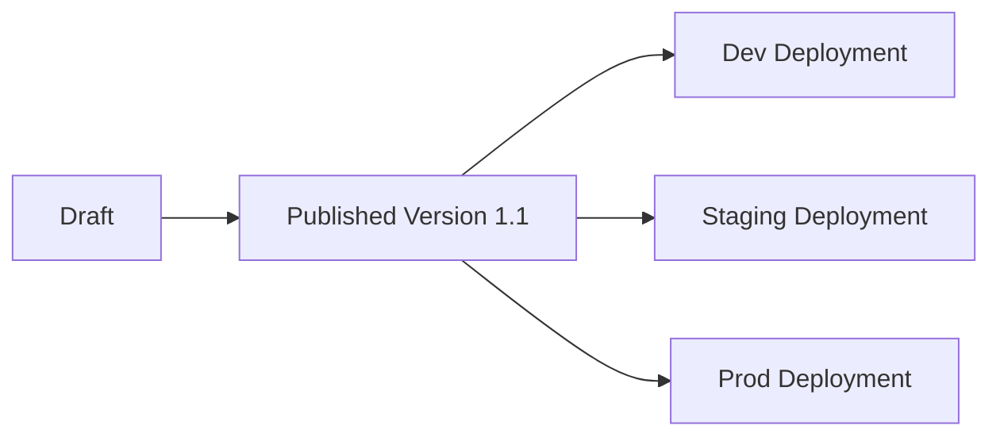

Publication lets you create versioned releases of a project and deploy those releases to development, staging, or production environments.

Publication applies only to SQL projects that use Simple Version Control. Projects that use standard Git workflows manage releases through Git instead.

## Publication workflow

Projects move through three lifecycle stages:

| Stage | Purpose |
|---------|---------|
| Save a draft | Save work in progress |
| Publish a version | Create a reusable project release |
| Deploy | Make that release available in an environment, such as Dev, Staging, or Prod |

<Note>
Publishing does not automatically run pipelines. After deployment, you can [schedule pipelines](/data-analysis/production/scheduling/scheduling) independently for each fabric. Schedules are associated with deployments, not published versions.
</Note>

## Save a draft

As you develop and edit your project, you can **save drafts** to store in-progress project changes before publication.

Use drafts to:

- Save work while continuing development.
- Collaborate with other users.
- Review changes before publication.
- Prepare a version for deployment.

Saving a draft does not create a deployable project version and does not make changes available in deployment environments.

## Draft pipelines

When you mark a pipeline as draft, Prophecy excludes its in-progress changes from the project's next published version — it doesn't remove the pipeline itself. For example, if a project includes pipelines `a`, `b`, and `c`, and you mark `b` as draft, the next published version includes your latest changes to `a` and `c`, while `b` remains unchanged in that version unchanged, frozen at whatever was last published for it. If `b` had never been published before you marked it as draft, it's simply left out of every published version until you remove the `draft` designation.

<Note>
"Save a draft" and "draft pipelines" both use the word _draft_ but mean different things by the term. Saving a draft records in-progress changes to the whole project. Marking a pipeline as draft excludes that pipeline from publication.
</Note>

Use a draft pipeline to:

- Continue developing a pipeline while excluding in-progress changes from the next release.
- Publish other pipelines in the project without waiting on unfinished work.

While a pipeline is marked as draft:

- Any in-progress changes are not included in the next published version. If it's already been published before, it ships unchanged in the new version; if it hasn't, it's left out of the version entirely.
- Any app built on that pipeline is held back the same way.
- The pipeline can't be renamed or deleted while it's a draft.

<Note>
Publishing the project doesn't remove the pipeline or interrupt it. Its last published version carries into the new release unchanged, and any existing schedule on it keeps running. That is, Prophecy redeploys that schedule's job with the same, unchanged definition as part of the release.
</Note>

When you remove draft status, the pipeline is included in the next version you publish; you don't need to take any special steps for the pipeline to
"catch up."

To mark or unmark a pipeline as draft, see [Mark Pipeline as Draft in the topic Pipelines for Data Analysis](/data-analysis/development/pipelines/data-analysis-pipelines#mark-pipeline-as-draft).

## Publish a version

Publishing creates a versioned release of your project. A published release can be deployed to one or more environments, but publishing alone does not deploy it.

Until deployment occurs, the published version remains available in Prophecy but is not yet available in a development or production environment.

When you publish a version, Prophecy:

- Assigns a version number and description.
- Packages the project.
- Makes the version available for deployment.

Published versions are immutable. After a version is published, it cannot be modified. Any changes require publishing a new version. This allows Prophecy to preserve published versions as stable references for deployment and rollback.

This helps you:

- Track project changes over time.
- Deploy consistent versions across environments.
- Roll back to earlier project versions if necessary.

## Deploy a project

When you **deploy** a project,you make a published version available for execution in a specific deployment environment.

In Prophecy, deployment environments are called [fabrics](/data-analysis/environment/fabrics/prophecy-fabrics). Examples include development, staging, and production environments for platforms such as Databricks, Snowflake, or BigQuery.

Different environments often require different configurations, such as connections, schemas, or runtime parameters. You can use [project parameter sets](/data-analysis/development/parameters/parameter-sets) to apply environment-specific configuration during deployment.

During deployment, Prophecy:

- Builds the project in the selected environment.
- Applies the selected project parameter set.
- Creates or updates the deployment for that environment.

You can deploy different versions of the same project to different environments. For example, a development environment might run version `1.1` while production continues to run version `1.0` until validation is complete.

Each environment (such as Dev or Prod) can contain only one deployed version of a project at a time.

After deployment, you can [schedule pipelines](/data-analysis/production/scheduling/scheduling) independently for each environment.
