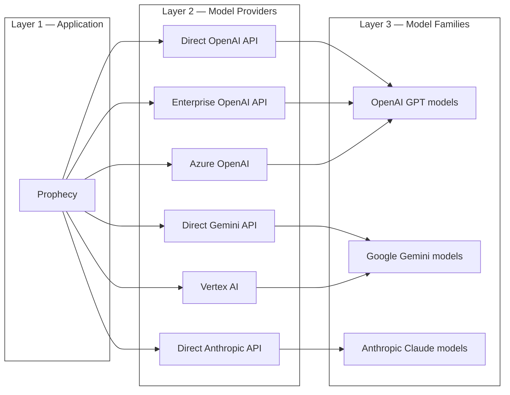

Prophecy integrates with multiple LLM providers and model families. This gives you flexibility in choosing the right models depending on your deployment type and performance needs.

SaaS uses a Prophecy-managed OpenAI subscription with GPT-4o and GPT-4o mini. Meanwhile, Dedicated SaaS deployments are expected to connect to customer-managed endpoints.

Each AI endpoint configuration requires two models:

- Smart LLM for complex tasks, such as `gpt-4o`.
- Fast LLM for lightweight tasks, such as `gpt-4o-mini`.

<Info>
  For Dedicated SaaS deployments, see [Copilot
  settings](/administration/management/cluster-admin-settings/copilot-settings) to learn how to
  connect Prophecy to your LLM.
</Info>

## Supported providers

## Supported models

While Prophecy can connect to all providers shown in the diagram, the following models are officially tested and supported:

- `gpt-4o`
- `gpt-4o-mini`
- `gemini-2.5-flash`
- `gemini-2.5-flash-lite`
