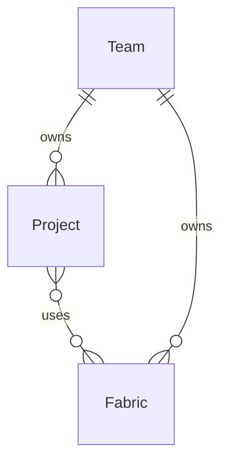

Prophecy lets you work with various data providers when building your pipelines. To read and write data from external sources, create **connections** inside a [Prophecy fabric](/data-analytics/environment/fabrics/prophecy-fabrics).

When you attach to a fabric with connections, you can:

- Reuse credentials that are established in the connection.
- Browse data from the data provider in the [Environment browser](/data-analytics/development/studio/studio#sidebar) of your Prophecy project.

<Info>
  Most connections are only used to read from and write to data sources. The SQL Warehouse
  connection is an exception: it also provides the compute environment for pipeline execution.
</Info>

## Connections access

Prophecy controls access to connections through fabric-level permissions. To access a connection, you must have access to the fabric that contains the connection. You can only access fabrics that are assigned to one of your teams.

<Frame>

</Frame>

In this diagram, the lines show relationships between entities. `||--||` indicates a one-to-one relationship, `||--o{` indicates a one-to-many relationship (one entity on the left can relate to many entities on the right), and `}o--o{` indicates a many-to-many relationship.

## Add a new connection

To configure a new connection in a Prophecy fabric:

- Open the **Metadata** page from the left sidebar in Prophecy.
- Navigate to the **Fabric** tab.
- Open the fabric where you want to add the connection.
- Navigate to the **Connections** tab.
- Click **+ Add Connection**. This opens the **Create Connection** dialog.
- Select a data provider from the list of connection types.
- Click **Next** to open the connection details.
- Configure the connection and save your changes.

Learn about individual connection parameters in the connection's respective reference page.

## What's next

Visit the following pages to learn more about available connections.
