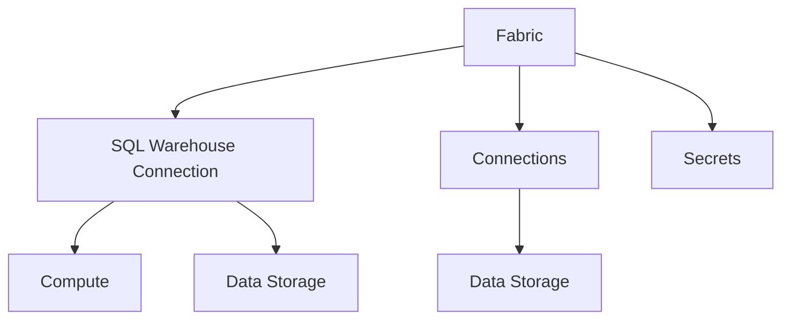

A fabric is a Prophecy entity that contains all of the connection information you need to connect to **external compute** and **data storage**. You need fabrics to run pipelines.

<Note>
  Prophecy provides you with compute and data storage for Free and Professional Editions. Users on
  Express and Enterprise Editions need to connect to their own compute and data storage.
</Note>

## Key concepts

### External compute

A fabric connects to a SQL engine that runs your pipeline transformations. This compute engine executes the SQL queries and performs the data transformations that your pipelines generate.

You access compute through your primary SQL warehouse connection, such as Databricks SQL, BigQuery, or Prophecy In Memory.

### Data storage

A fabric connects to storage systems that hold your data. You read from sources and write to targets in your pipelines. There are two types of data storage:

- **Warehouse data storage**: Storage that is integrated with your compute engine. For example, when you use a Databricks SQL warehouse connection, it accesses data in Unity Catalog. SQL warehouses can only access data that is local to the warehouse. They cannot read from or write to external systems.
- **External data storage**: Storage systems that are separate from your compute engine. To move data in and out of the warehouse, you use ingress/egress connections through [Prophecy Automate](/data-analytics/administration/platform/architecture#what-is-prophecy-automate) (Prophecy-native runtime). Prophecy Automate handles data movement between external systems and your warehouse. This includes managing secrets and credentials necessary to access external systems.

## Fabric components

The following table describes how fabric components map to the key concepts.

| Component                  | Description                                                                                                                                                                                                                                |
| -------------------------- | ------------------------------------------------------------------------------------------------------------------------------------------------------------------------------------------------------------------------------------------ |
| SQL Warehouse Connection   | Connection to the SQL compute engine and the coupled data storage for that provider. A primary warehouse connection is required for every Prophecy fabric to execute SQL queries generated by your pipeline.                               |
| Ingress/Egress Connections | Connections to external data providers. Each connection can be used to read and write data from supported locations. For the full list of supported connections, visit [Connections](/data-analytics/environment/connections/connections). |
| Secrets                    | Secrets store sensitive data. Use Prophecy secrets to store credentials that authenticate your connections in the fabric. To learn more, see [Secrets](/data-analytics/environment/secrets/secrets).                                       |

## Fabric provisioning

Prophecy fabrics are provisioned differently depending on your [Prophecy edition](/data-analytics/administration/platform/editions).

| Edition                      | Description                                                                                                                                                                                                                             |
| ---------------------------- | --------------------------------------------------------------------------------------------------------------------------------------------------------------------------------------------------------------------------------------- |
| Free & Professional Editions | Each user automatically receives a personal fabric that is linked to their team. These fabrics run on **Prophecy In Memory**, and all execution is fully managed by Prophecy. Usage is billed in credits.                               |
| Express Edition              | Users create fabrics manually and connect them to their own Databricks SQL warehouse. Prophecy Automate is included, while Databricks costs are managed separately by the user.                                                         |
| Enterprise Edition           | Users create fabrics manually and can connect to any external SQL engine supported by Prophecy, including Databricks SQL warehouse and BigQuery. Prophecy Automate is included, and warehouse costs are managed separately by the user. |

<Note>Free and Professional Editions do not support creating new fabrics.</Note>

## Supported primary SQL warehouses

Prophecy fabrics can be connected to one of several primary SQL warehouses. The warehouse you choose provides the compute and determines the SQL dialect for all pipelines in the fabric.

| SQL Warehouse      | Description                                                                                                                                                                        |
| ------------------ | ---------------------------------------------------------------------------------------------------------------------------------------------------------------------------------- |
| Prophecy In Memory | Exclusive to Free and Professional Editions. This warehouse is fully managed by Prophecy and powered by DuckDB. All pipeline transformations execute using the DuckDB SQL dialect. |
| Databricks SQL     | Supported in Express and Enterprise Editions. Connect your own Databricks SQL warehouse to run pipeline transformations.                                                           |
| Google BigQuery    | Supported in Enterprise Edition. Connect to your BigQuery environment to run pipeline transformations.                                                                             |
