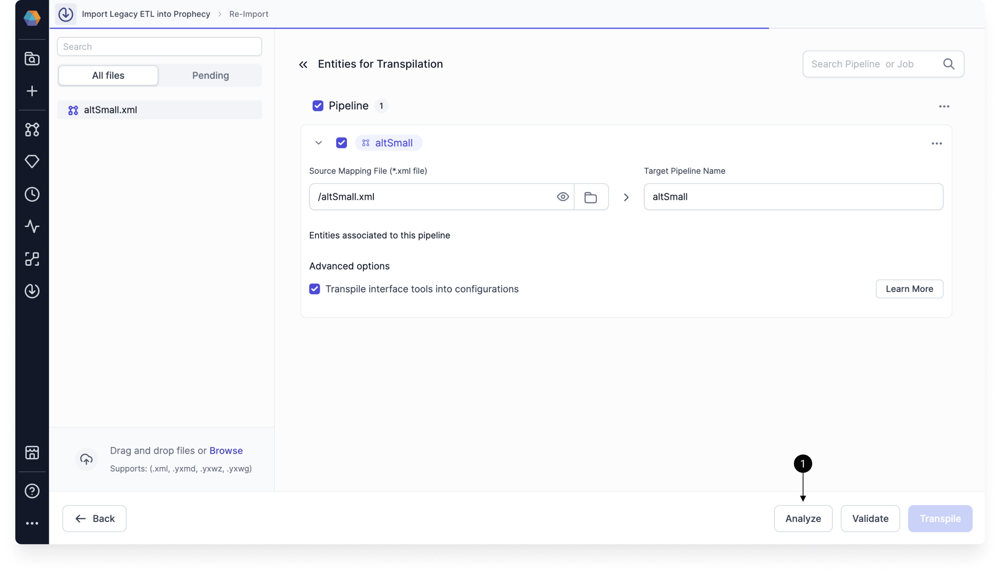

Prophecy's Analyze tool helps you preview the outcome of your Alteryx-to-Spark or Alteryx-to-SQL migration before you actually run the transpilation. This allows you to identify any gaps in tool or function coverage, understand workflow complexity, and anticipate any required fixes.

The Analyze tool runs Prophecy’s **Analyzer engine** and presents the results during the Import workflow, so you can assess migration readiness before committing to a full transpilation.

## Overview

The Analyze tool can help you understand the outcome of your Alteryx transpilation **before** running the transpilation. This is available during the [import](/import-tool/alteryx/alteryx-to-spark/alteryx-to-spark#import-pipelines) step of pipeline migration.

1. Open the Import tool from the left sidebar in Prophecy.
1. Click **Import Bundle** and begin the migration process.
1. Upload your Alteryx workflows.
1. At the bottom of the migration interface, click **Analyze**.
1. Prophecy evaluates each workflow and component, checks migration coverage, and scores complexity.
1. Download the report as an Excel file to inspect the analysis.

<Info>
The analysis is based on the tools, functions, and patterns Prophecy can currently migrate “out of the box.” Anything not yet supported is flagged so you can plan ahead.
</Info>

## Analysis report format

When you run the analysis, Prophecy generates an Excel report containing multiple tabs. Each tab highlights a different aspect of migration readiness, helping you understand both _what_ will migrate and _how much effort_ may be required after Import.

| Tab                      | Description                                                  |
| ------------------------ | ------------------------------------------------------------ |
| Summary              | Provides a high-level snapshot of overall migration readiness, including Import coverage, supported patterns, and workflow complexity. |
| Coverage             | Details which workflows and tools can be processed successfully by Import, along with counts of migrated and unsupported components. |
| Patterns Support     | Reports whether specific tools and functions used in your workflows are supported by Prophecy’s mapping patterns. |
| Workflows Complexity | Assigns a low, medium, or high complexity rating to each workflow based on size, tool composition, and expected diagnostics. |
| Tool Type Complexity | Rates individual tool types by migration difficulty, reflecting both support coverage and behavioral complexity. |

### How to interpret the report

- **Coverage** indicates whether workflows and tools can be imported end-to-end.
- **Patterns Support** shows whether specific tools and functions have supported Prophecy equivalents.
- **Complexity scores** help estimate post-Import effort: workflows with higher complexity typically require more manual review and adjustment after migration. The overall complexity score is calculated using weighted contributions from workflow size, tool types, and diagnostics, with tool type complexity carrying the greatest influence.

<Tip> More detailed explanations for each tab, including calculation logic and definitions, are included directly in the Excel report. </Tip>

## Summary tab

Below is an example of what the **Summary** tab might look like for a migration from Alteryx → Spark Python.

### Migration coverage

- Import Coverage: 26% of tools migrated successfully
- Workflows: 1/1 migrated successfully (100%)
- Tools: 6/23 migrated successfully (26%)

### Migration patterns support

- Unique Tools Supported: 11/11 (100%)
- Unique Functions Supported: 1/1 (100%)

### Workflows complexity

In the Workflows Complexity tab, the report includes the following columns along with ratings for each.

- Workflow name
- Complexity classification (Low, Medium, High)
- Overall complexity score
- Workflow size complexity
- Tool type complexity
- Diagnostic complexity

Workflow complexity is derived from three contributing factors that are evaluated independently and then combined into an overall score:

- Workflow size complexity: reflects the number of tools in the workflow.

- Tool type complexity: reflects the mix of simple, advanced, and unsupported tools.

- Diagnostic complexity: reflects the number of compilation diagnostics produced during analysis.

Each factor is scored separately and weighted to produce an overall complexity score:

- Low: overall score between 0 and 1
- Medium: overall score between 1 and 2
- High: overall score between 2 and 3

- Low: 0 workflows
- Medium: 0 workflows
- High: 1 workflow

### Tool type complexity

Tool complexity reflects both support coverage and behavioral difficulty. For example, tools like Summarize are rated medium due to multiple configuration paths, while tools such as Multi Row Formula are rated hard due to ordering and row-dependency semantics.

- Filter: Easy
- Formula: Easy
- Join: Easy
- Select: Easy
- Summarize: Medium
- Multi Row Formula: Hard
- Text Input: Easy

## Coverage tab

For each workflow analyzed, the Coverage tab reports:

- **Migration status**: whether the workflow can be processed by Import
- **Tools migrated successfully**: number of tool occurrences that were successfully migrated
- **Tools migration failed**: number of tool occurrences that could not be migrated
- **Total tool occurrences**: total number of tools across the workflow
- **Tools coverage**: percentage of tools successfully migrated
- **Workflows coverage**: percentage of workflows successfully migrated across the analysis set

Understanding workflow vs tool coverage:

- **Workflows Coverage** represents the percentage of workflows that Import can process end-to-end. A workflow is considered successfully migrated even if one or more tools within the workflow fail to migrate.
- **Tools Coverage** represents the percentage of individual tool occurrences that Import can migrate successfully across all analyzed workflows.

As a result, it is possible for Workflows Coverage to be 100% while Tools Coverage is significantly lower.

A tool marked as “migration failed” typically indicates that the tool or its configuration is not currently supported by Import and will require manual conversion after migration.

The Tools breakdown section lists the number of occurrences of each tool type within each workflow. This helps you:

- Identify workflows dominated by certain tool patterns
- Understand why tool coverage may be high or low
- Anticipate where most manual remediation effort will be required

Tools that appear frequently in the breakdown and have higher tool type complexity ratings (for example, Summarize or Multi Row Formula) often contribute disproportionately to overall migration effort.

## Patterns support tab

Patterns Support reports whether the **types of tools and functions** used in your workflows have supported mappings in Prophecy. It does **not** reflect whether every individual tool instance can be migrated successfully.

As a result, it is possible for Patterns Support to show 100% support even when Tools Coverage is significantly lower.

Use the Patterns Support tab to:

- Confirm whether custom expressions rely on unsupported functions.
- Identify whether migration issues are due to unsupported patterns or configuration-specific behavior.
- Prioritize review of tools that appear frequently in the workflow.

The Patterns Support tab is divided into two sections:

- **Tools**: evaluates whether each tool type used in the workflow has a supported migration pattern.
- **Functions**: evaluates whether the expressions and functions used within tools can be mapped to Prophecy-supported equivalents.

Occurrences indicate how many times a given tool or function appears across all analyzed workflows.

Function occurrence counts are often higher than tool counts because a single tool (such as Formula or Filter) may reference multiple functions.

A tool or function marked as **Supported** indicates that Prophecy has a defined mapping pattern for that tool or function. Individual tool instances may still require manual adjustment depending on configuration, data types, or interaction with other tools.

## Summary

To summarize, running the Analyze tool before migration helps you:

- **Estimate effort**: Identify complex workflows and unsupported tools ahead of time.
- **Plan fixes**: Know which components will require manual conversion or adjustments.
- **Reduce migration risk**: Catch potential blockers before investing in a full migration.
- **Prioritize work**: Focus on the highest-value or lowest-effort workflows first.
- **Estimate post-Import effort**: Complexity scores and diagnostics help predict how much manual adjustment will be needed after Import.
