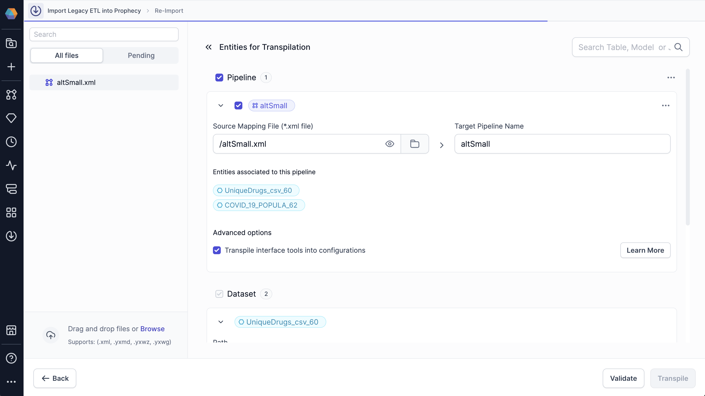
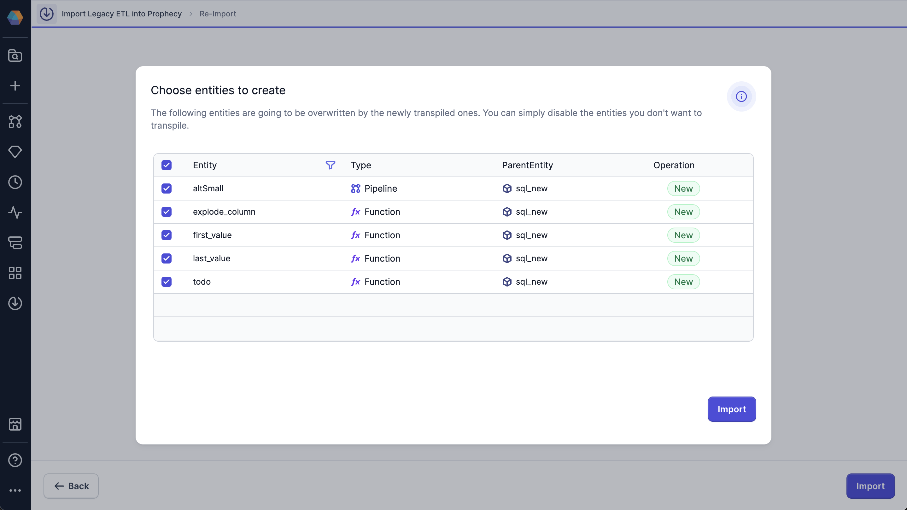
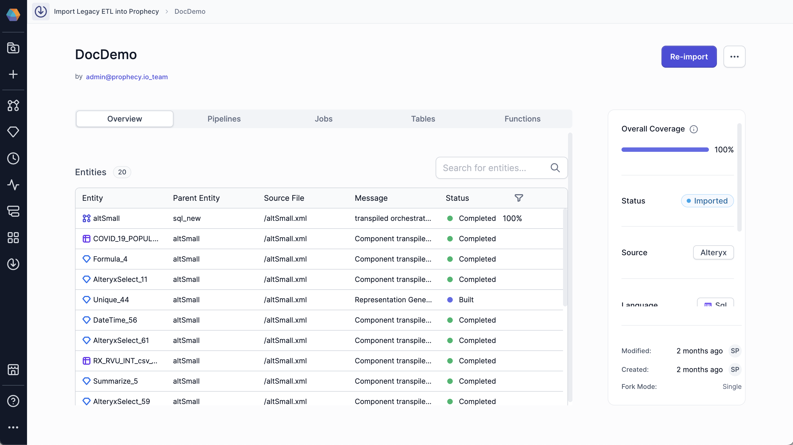
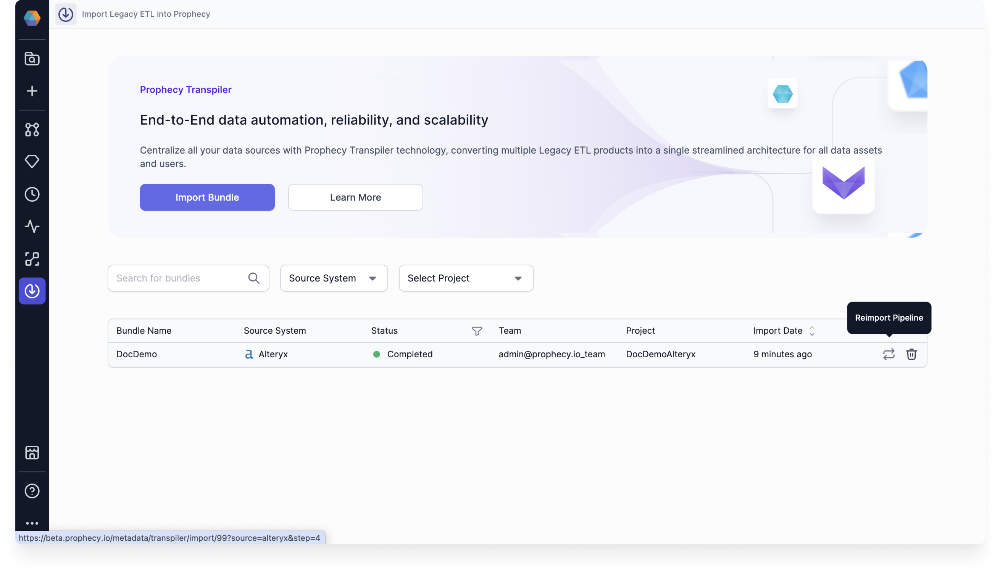

When you create an Alteryx bundle for a SQL project in the Prophecy transpiler, you can analyze, change, and validate your migration before the transpilation begins.

## Limitations

Review the supported versions and migration scope:

- Prophecy supports transpiling files from Alteryx Designer version 2023.2 and later.
- Prophecy cannot migrate Alteryx schedules. You must [manually configure your schedule](/data-analysis/production/scheduling/scheduling) in your Prophecy project after you transpile your Alteryx workflow. Then, you can monitor your schedule on [the Monitoring page](/data-analysis/production/monitoring#scheduled-pipelines).

## Prerequisites

To migrate workflows from Alteryx to Prophecy, you need to:

- Ensure that the Alteryx Transpiler is enabled in your Prophecy environment.
- Export the Alteryx workflows that you want to migrate as files. Prophecy accepts `.xml`, `.yxmd`, `.yxwz`, and `.yxmc` files. For more information on these file types, visit [Alteryx File Types](https://help.alteryx.com/current/en/designer/file-types-support/alteryx-file-types.html#alteryx-file-types) in the Alteryx documentation.

After transpilation, review migration coverage and any placeholder gems before importing entities into production projects.

How to export an Alteryx workflow

To export an Alteryx workflow from the Alteryx Designer:

1. Open Alteryx and navigate to the workflow you want to export.
1. On the top navigation bar, click **File**.
1. Click **Save As**, then click **Browse**.
1. Navigate to where you want to save your file, then click **Save**.

## Differences between importing Databricks, BigQuery and Snowflake SQL

The SQL dialect generated during import depends on the selected fabric:

- **Databricks fabric → Databricks SQL**
- **BigQuery fabric → BigQuery SQL**
- **Snowflake fabric → Snowflake SQL**

You cannot change the SQL dialect after import without recreating the bundle.

While the migration workflow is the same, some behaviors differ depending on the selected fabric:

- **SQL syntax**: Generated SQL follows the target engine (Databricks, BigQuery, Snowflake).
- **Tool support**: Some Alteryx tools may map differently depending on engine capabilities.

See [SQL dialect differences](/import-tool/alteryx/alteryx-to-prophecy-sql/sql-dialect-differences) for more detail.

## What Prophecy creates during migration

Depending on your workflow and import settings, Prophecy can create:

- One or more SQL pipelines.
- Supporting datasets and tables.
- Pipeline configurations from Alteryx interface tools.
- An orchestration pipeline for split workflows.

## Procedure

<Steps>
<Step title="Create a bundle">

Start with creating a new Import bundle. A bundle stores uploaded files, validation results, and generated entities.

1. On the left navigation bar, click the **Import icon** (arrow pointing down in a circle).
1. At the top of the page, click **Import Bundle**.
1. In the **Source Type** tab, select **Alteryx**.
1. Click **Next**.
1. In the **Bundle Details** tab, fill out the following fields:

   | Field              | Action                                                                                                                                                           |
   | ------------------ | ---------------------------------------------------------------------------------------------------------------------------------------------------------------- |
   | Import Bundle Name | Provide a name for the bundle.                                                                                                                                   |
   | Language           | Select **SQL** as the primary code language.                                                                                                                     |
   | Team               | Create or select the team that will be able to access the bundle.                                                                                                |
   | Project            | Create or select the project where Prophecy will add migrated pipelines. The project you choose must have the same language and team defined in the bundle. |
   | Branch             | Select the Git branch where the migration will appear.  The Transpiler will not commit directly to the `main` branch of the project repository.             |
   | SQL Fabric         | Choose the [fabric](/data-analysis/environment/fabrics/prophecy-fabrics) that determines the SQL dialect and execution engine for your migrated pipelines.  - Select a **Databricks** fabric to generate Databricks SQL. - Select a **BigQuery** fabric to generate BigQuery SQL.                                      |

1. Click **Next**.
1. In the **Upload Files** tab, upload the Alteryx files you want to migrate.

   Prophecy accepts `.xml`, `.yxmd`, `.yxwz`, and `.yxmc` files.

1. Click **Next**. The Transpilation step opens.

</Step>

<Step title="Configure Import details">

Configure how Prophecy imports your workflows.

1. In the left sidebar under **All files**, review the files you uploaded.
1. If necessary, add more files to the bundle by dragging and dropping or browsing your local file system.
1. To stage a file for transpilation, click on the file.

   The file appears under **Entities for Transpilation**.

1. For each pipeline that you stage:
   - Review the **Source Mapping File** to verify the original file that corresponds to the new pipeline.
   - Verify or change the **Target Pipeline Name**, which will be the name of your new Prophecy pipeline.
   - Check the **Entities associated with this pipeline** section to see the datasets that will be created.
   - Enable the **Transpile interface tools into configurations** checkbox if you want to convert interface tools from Alteryx into pipeline configurations in Prophecy.
   - Check the **Break into Multiple Workflows** checkbox to split large Alteryx workflows into smaller Prophecy pipelines. See [Split large workflows into multiple pipelines](#split-large-workflows-into-multiple-pipelines) below for more details.
      - Optionally, enable **Preserve Visual Containers** to keep Alteryx container groupings together during workflow splitting.

1. Click **Validate** to have Prophecy check that the migration is possible for all staged files. Validation checks whether the uploaded workflows can be successfully transpiled and identifies unsupported tools, missing metadata, or configuration issues before conversion begins.
1. Once validation passes, click **Transpile** to begin the actual conversion process. The Transpile button is only enabled after successful validation.

<Note>
  Once you add a pipeline or table to the bundle, you can disable the import by deselecting the
  relevant checkbox. Disabling the import is useful if you want to save the pipeline or table in the
  import configuration to import it at a later time.
</Note>

</Step>
<Step title="Import transpiled entities">

Import the transpiled entities into your project.

1. After you click Transpile, the **Choose entities to create** dialog opens.
1. Review a list of entities that the transpiler has detected.
1. Disable entities that you do not want to migrate, if needed.
1. Click **Import > Import**.
1. Click **View Bundle Details**.

</Step>
<Step title="Review Prophecy project">

Verify and adjust transformations as needed. If there isn't an equivalent gem for a certain transformation, Prophecy inserts a placeholder gem in your pipeline where you can write your own SQL statements to achieve the required functionality.

### Step 5: Review bundle metadata

After you successfully import a bundle, you see the **Imported** status on the Transpiler page.

To see the bundle metadata, which includes information about all of the imported entities in the bundle, click on the bundle.

You can review the pipelines, jobs, tables, function, coverage, status, source, language, project, and fabric of the bundle in the right tile. You can open any entity in a new tab in the project editor by clicking on the entity.

<Note>
If Prophecy cannot fully transpile a transformation, it inserts a placeholder gem so you can manually implement the required SQL logic. In some cases, you may be able to use [Prophecy's Agent](/data-analysis/ai/agent/agent) to generate this SQL.
</Note>

</Step>

<Step title="Validate migrated pipelines">

Open your bundle and run your pipeline to verify that it writes the same output as your Alteryx workflow. If not, modify or add additional gems to make the output the same.

Before you deploy your project into production, we recommend that you run both your Alteryx workflow and Prophecy pipeline in parallel for at least two weeks. This helps you see if Prophecy consistently produces the same output as Alteryx.

</Step>

</Steps>

### Reimport pipelines

If you want to update or restart your import, click on the **Reimport Pipeline** button on the Transpiler page.

For support, please see [Getting help with Prophecy](/data-analysis/administration/getting-help/get-in-touch).

### Split large workflows into multiple pipelines

For large SQL workflows, you can enable **Break into multiple workflows** during import. When enabled, Prophecy can split a large Alteryx workflow into multiple smaller Prophecy pipelines.

When a workflow is split, Prophecy creates:

* An orchestration pipeline that runs the generated pipelines in sequence.
* Multiple generated sub-pipelines, named with suffixes such as `_part1`, `_part2`, and so on.

Workflow splitting is intended for large workflows. Smaller workflows may remain as a single pipeline even when this option is enabled.

To preserve the structure of the original Alteryx workflow, Prophecy can also preserve Alteryx visual containers when breaking up workflows. To enable this behavior, select **Preserve Visual Containers** during import. The generated pipelines retain the original workflow layout and container groupings where possible.

When a workflow is split:

- Prophecy does not split the contents of a visual container across multiple pipelines.
- Connections that cross pipeline boundaries are replaced with intermediate datasets that transfer data between generated pipelines.
- Intermediate source and target datasets appear in labeled visual containers in the generated pipelines.

In some cases, Prophecy may import the workflow as a single pipeline even when **Break into multiple workflows** is enabled.

This can happen when:

- The resulting pipeline contains fewer than 200 gems.
- The workflow structure cannot be safely divided into multiple pipelines, such as when required schema information is unavailable.
- When workflows contain dependencies that prevent safe splitting.

## Troubleshooting

### A workflow was not split into multiple pipelines

Large workflows may remain as a single pipeline if Prophecy cannot safely determine split points or required metadata.

### A transformation became a placeholder gem

Some Alteryx tools do not have a direct SQL equivalent and require manual implementation.
