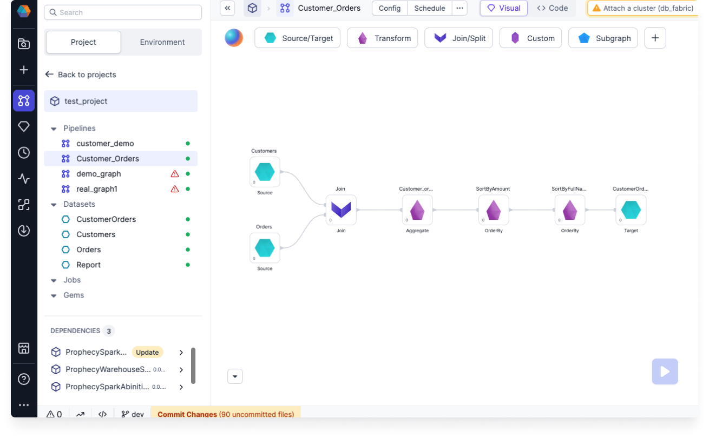
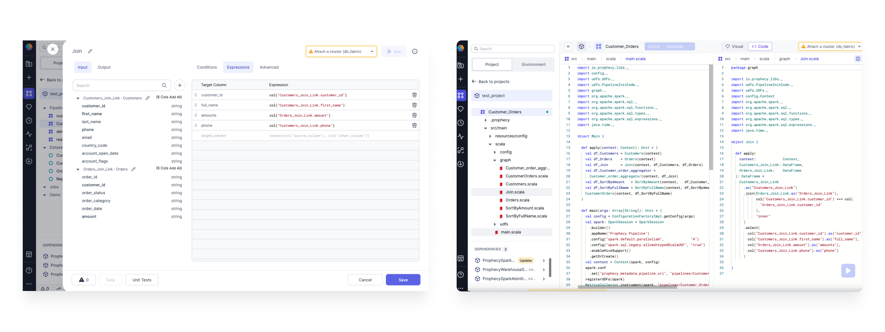
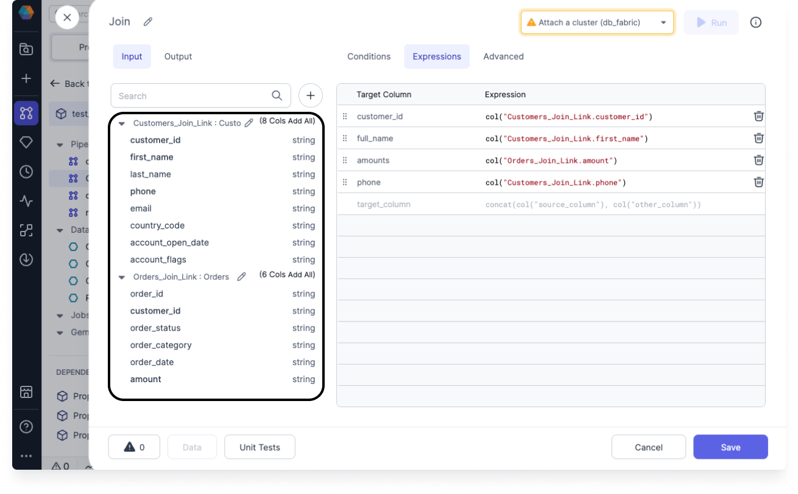

In today’s fast-paced business world, adapting and evolving are essential for any enterprise wanting to stay ahead.

If you’re still using Alteryx, migrating to a modern, agile platform can feel overwhelming. But it doesn’t have to be. Our Transpiler simplifies the move away from outdated ETL systems to Prophecy—the first modern, low-code platform designed specifically for data engineers.

## Manual migration challenge

Manually migrating from legacy ETL systems often takes up too much time and resources, and the process of breaking down and rebuilding Alteryx workflows comes with significant risks, including the chance of data loss or disruption. Additionally, the costs can quickly add up, making it clear that you need a better solution.

## Spark vs. Alteryx

Before we dive into what the Transpiler can do, it’s important to understand how it measures up against Alteryx. While Alteryx has been valued for its reliability and versatility, Apache Spark and Spark SQL provide a fresh perspective that delivers unmatched scalability, performance, and flexibility.

| Capability               | Apache Spark and Spark SQL                                        | Alteryx                                                  |
| ------------------------ | ----------------------------------------------------------------- | -------------------------------------------------------- |
| **Licensing**            | Open-source                                                       | Proprietary                                              |
| **Cost**                 | Free to use                                                       | Requires licensing fees                                  |
| **Development Language** | Scala, Java, Python, SQL                                          | Drag-and-drop interface, supports R and Python scripting |
| **Scalability**          | Highly scalable, supports large-scale data processing             | Scalable, designed for desktop and server deployments    |
| **Performance**          | In-memory processing for speed                                    | High performance, but constrained by hardware            |
| **Flexibility**          | Open-source ecosystem, vast libraries                             | Proprietary framework and components                     |
| **Vendor Lock-In**       | No vendor lock-in, open standards                                 | Vendor lock-in due to proprietary nature                 |
| **Customization**        | Highly customizable, allows for custom development and extensions | Limited customization through plugins                    |

## How Transpiler works

Transpiler is a powerful tool that transforms the often complex process of ETL migration into something more manageable by:

- **Workflow Parsing**

  Transpiler naturally parses Alteryx's `.xml`, `.yxmd`, `.yxwz`, `.yxmc`, and `.yxzp` files. It deciphers its complex components and relationships to recreate the equivalent workflow in Prophecy. A Prophecy workflow is called a [pipeline](/data-engineering/development/pipelines/pipelines). Prophecy components contain all the business logic from the Alteryx components.

  

- **Transformation Logic**

  By examining Alteryx's files, Transpiler identifies the embedded transformation logic within each component. Then, it generates **highly optimized open-source** Spark code that seamlessly integrates into any Spark environment.

  For example, the following shows how a Join Gem looks in both the **Visual** and **Code** views:

  

- **Schema Mapping**

  Transpiler effectively maps the data schema from Alteryx’s files, ensuring a smooth transition to Prophecy. This guarantees that the input and output schemas in Prophecy gems align.

  For example, the following shows the schema inside the Join gem:

  

## Next steps

Migrating from Alteryx to Transpiler is not just an option; it’s an opportunity to future-proof your data infrastructure. Transpiler transforms a potentially complex journey into a straightforward transition that unleashes the full potential of Spark’s unparalleled capabilities.

Let's dive deeper into the specifics of Alteryx Transpiler now:

```mdx-code-block
import DocCardList from '@theme/DocCardList';
import {useCurrentSidebarCategory} from '@docusaurus/theme-common';

<DocCardList items={useCurrentSidebarCategory().items}/>
```
