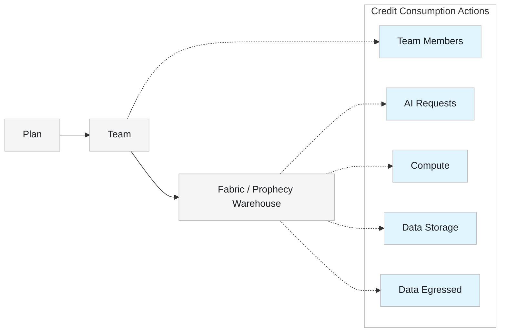

<Callout icon="/images/icon.png" color="#FFC107">

Credits apply to the [Free and Professional Editions](/data-engineering/administration/platform/editions) only.

</Callout>

In Prophecy, **credits** represent a unified measure of usage across the platform.

Plans, teams, and fabrics define how billing and credit consumption are organized.

- A plan is the top-level billing unit. Each plan includes exactly one team.
- A [team](/data-analytics/administration/management/teams/teams) represents a group of users who share access to resources through one fabric.
- A [fabric](/data-analytics/environment/fabrics/prophecy-fabrics) points to a dedicated Prophecy warehouse database and compute resources.

<Info>
  To learn about monitoring credit usage and buying additional credits, see [Usage and
  billing](/data-engineering/administration/management/usage-billing/usage-billing).
</Info>

## How credits are charged

The following actions consume the corresponding number of credits.

| Action            | Description                                              | Credits Consumed |
| ----------------- | -------------------------------------------------------- | ---------------- |
| **Team Members**  | Number of users allowed on your plan                     | 20 / user        |
| **AI Requests**   | Each time you click on Copilot or interact with an Agent | 0.04 / request   |
| **Compute**       | Processing required when running a gem or pipeline       | 3 / CPU hour     |
| **Data Egressed** | Data sent outside the Prophecy warehouse                 | 0.045 / GB       |
| **Data Storage**  | Data stored in the Prophecy warehouse                    | 0.02 / GB        |

<Note>
  The Prophecy warehouse is powered by DuckDB. Advanced users can update the DuckDB SQL queries in
  the **Code** view of their project to optimize computation and reduce credit consumption.
</Note>

## Relationship diagram

The following diagram shows how credit consumption actions relate to plans, teams, and fabrics.

